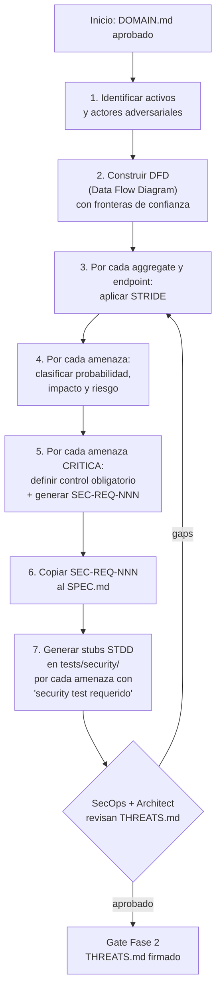
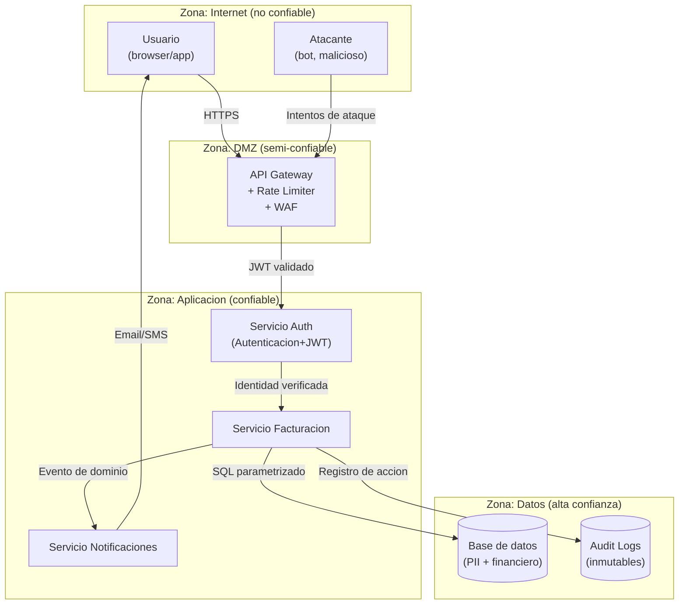
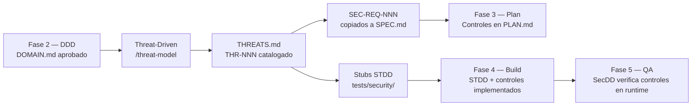

# Threat-Driven Development

**Version:** 1.0 | **Fecha:** 2026-06-04 | **Gobernanza:** Constitucion X-DD v1.5

---

## Indice

1. [Que es Threat-Driven Development en X-DD](#1-que-es-threat-driven-development-en-x-dd)
2. [Metodologia STRIDE](#2-metodologia-stride)
3. [El proceso de threat modeling](#3-el-proceso-de-threat-modeling)
4. [Formato THR-NNN](#4-formato-thr-nnn)
5. [Activos y actores adversariales](#5-activos-y-actores-adversariales)
6. [Analisis por aggregate](#6-analisis-por-aggregate)
7. [Documentacion de controles](#7-documentacion-de-controles)
8. [Threat-Driven en el pipeline](#8-threat-driven-en-el-pipeline)
9. [Agentes involucrados](#9-agentes-involucrados)

---

## 1. Que es Threat-Driven Development en X-DD

Threat-Driven Development es la disciplina que aplica modelado de amenazas antes del
desarrollo, no como auditoria posterior. En X-DD, las amenazas se identifican y
documentan en la Fase 2 (Spec), cuando el modelo de dominio ya existe pero el codigo
todavia no. Esto permite que los controles de seguridad sean requisitos de diseno, no
parches reactivos.

El principio central es: antes de construir, atacar. Antes de escribir una linea de
codigo, el equipo se pregunta como un atacante intentaria comprometer el sistema.

Threat-Driven Development opera sobre el `DOMAIN.md` producido por DDD. Por cada
aggregate, endpoint y domain event identificado en el modelo de dominio, se aplica el
framework STRIDE para identificar las categorias de amenaza relevantes. Las amenazas
criticas se convierten en `SEC-REQ-NNN` que se copian obligatoriamente al `SPEC.md`.

El artefacto central es `docs/specs/THREATS.md`.

---

## 2. Metodologia STRIDE

STRIDE es el framework de clasificacion de amenazas creado por Microsoft. Organiza las
amenazas en seis categorias que cubren el espacio de ataques de forma exhaustiva.

| Categoria | Descripcion | Propiedad de seguridad violada | Ejemplo |
|-----------|-------------|-------------------------------|---------|
| Spoofing | El atacante se hace pasar por otro usuario o sistema | Autenticacion | JWT robado, session hijacking |
| Tampering | El atacante modifica datos en transito o en reposo | Integridad | Modificacion de payload HTTP, tamper de DB |
| Repudiation | El atacante niega haber realizado una accion | No repudio | Accion sin registro en audit log |
| Information Disclosure | El atacante accede a datos que no deberia ver | Confidencialidad | Error con stack trace, PII en logs |
| Denial of Service | El atacante hace el sistema inaccesible | Disponibilidad | Flood de requests, payload gigante |
| Elevation of Privilege | El atacante obtiene permisos que no tiene | Autorizacion | RBAC bypass, IDOR, escalada horizontal |

Para cada componente del sistema (aggregate, endpoint, domain event), se evalua cada
categoria STRIDE y se determina si la amenaza es aplicable.

---

## 3. El proceso de threat modeling

El proceso de threat modeling en X-DD sigue siete pasos secuenciales que producen el
THREATS.md aprobado.



### Reglas del proceso

- El `Architect` entrega `DOMAIN.md` aprobado antes de iniciar el threat modeling.
- El `SecOps` lidera el threat modeling usando el workflow `/threat-model`.
- Ningun aggregate del DOMAIN.md puede quedar sin al menos una amenaza analizada.
- Las amenazas CRITICAS sin control documentado bloquean el gate de Fase 2.
- El revisor de THREATS.md no puede ser el mismo agente que lo escribio.

---

## 4. Formato THR-NNN

Cada amenaza en THREATS.md usa el identificador `THR-NNN` donde NNN es un numero
secuencial de tres digitos con ceros iniciales.

### Estructura de una entrada THR-NNN

| Campo | Descripcion | Ejemplo |
|-------|-------------|---------|
| `THR-NNN` | Identificador unico | `THR-001` |
| Categoria STRIDE | Una de las seis categorias | `Elevation of Privilege` |
| Componente afectado | Aggregate, endpoint o domain event | `Aggregate: Factura` |
| Vector de ataque | Como se materializa la amenaza | IDOR: acceder al endpoint `/api/facturas/:id` con ID de otro tenant |
| Probabilidad | HIGH / MEDIUM / LOW | HIGH |
| Impacto | HIGH / MEDIUM / LOW | HIGH |
| Riesgo | CRITICO / ALTO / MEDIO / BAJO | CRITICO |
| Control propuesto | Que debe implementarse para mitigar | Verificacion de tenantId en cada query; no confiar en el ID de la URL |
| SEC-REQ vinculado | Requisito de seguridad derivado en SPEC.md | `SEC-REQ-001` |
| Security test requerido | SI / NO | SI |
| Estado | ABIERTO / MITIGADO / ACEPTADO | ABIERTO |

---

## 5. Activos y actores adversariales

El threat modeling comienza identificando los activos que proteger y los actores que
podrian atacarlos. Esta tabla se documenta al inicio de THREATS.md.

### Activos

| Activo | Criticalidad | Descripcion |
|--------|-------------|-------------|
| Datos PII de usuarios | CRITICO | Nombres, emails, documentos de identidad |
| Credenciales de acceso | CRITICO | Passwords hasheados, tokens de sesion, API keys |
| Datos financieros | CRITICO | Facturas, pagos, saldos, numeros de tarjeta |
| Configuracion del sistema | ALTO | Parametros de conexion, secrets de entorno |
| Logs de auditoria | ALTO | Registro de acciones de usuarios y sistema |
| Codigo fuente | MEDIO | Logica de negocio propietaria |
| Datos no sensibles | BAJO | Configuraciones publicas, metadatos no criticos |

### Actores adversariales

| Actor | Motivacion | Capacidad | Acceso inicial |
|-------|-----------|-----------|---------------|
| Usuario autenticado malicioso | Acceder a datos de otros usuarios | Bajo-Medio | Credenciales validas propias |
| Atacante externo no autenticado | Comprometer el sistema por fama o beneficio economico | Medio-Alto | Sin acceso; usa vectores publicos |
| Empleado interno con acceso | Exfiltrar datos o sabotear operaciones | Alto | Acceso legitimo al sistema |
| Bot automatizado | Abuso de API, scraping, credential stuffing | Bajo-Medio | Endpoints publicos |
| Proveedor de servicios comprometido | Acceso lateral desde dependencias | Medio | Acceso a la cadena de suministro |

---

## 6. Analisis por aggregate

Por cada aggregate del DOMAIN.md, se aplica STRIDE completo. El diagrama DFD (Data Flow
Diagram) muestra el flujo de datos con las fronteras de confianza.

### Diagrama DFD con fronteras de confianza



### Ejemplo de analisis STRIDE por aggregate

El siguiente ejemplo muestra el analisis para el aggregate `Factura`:

| THR-NNN | STRIDE | Vector | Prob | Impacto | Riesgo | Control | Security test |
|---------|--------|--------|------|---------|--------|---------|---------------|
| THR-001 | Elevation of Privilege | IDOR en GET /facturas/:id — acceso a facturas de otro tenant | HIGH | HIGH | CRITICO | Verificar tenantId del JWT contra tenantId de la factura | SI |
| THR-002 | Tampering | Modificacion del campo `total` en el payload de emision | MEDIUM | HIGH | ALTO | Calcular total en servidor; ignorar total del cliente | SI |
| THR-003 | Information Disclosure | Error 500 expone stack trace con query SQL | HIGH | MEDIUM | ALTO | Centralizar error handling; nunca exponer detalles en prod | SI |
| THR-004 | Repudiation | Emision de factura sin registro en audit log | LOW | HIGH | MEDIO | Registrar toda emision en logs inmutables antes de responder | NO |
| THR-005 | Denial of Service | Generacion masiva de PDFs por bot no autenticado | MEDIUM | MEDIUM | MEDIO | Rate limiting por IP + autenticacion obligatoria | NO |

---

## 7. Documentacion de controles

Cada amenaza con riesgo CRITICO o ALTO debe tener un control documentado con suficiente
detalle para que el `Builder` lo implemente. Un control vago ("usar autenticacion") no
es aceptable.

### Formato de control bien documentado

```markdown
### Control para THR-001: IDOR en exportacion de facturas

**Descripcion del control:**
En cada consulta a la tabla `facturas`, agregar una clausula WHERE que verifique
que `tenant_id` coincide con el `tenant_id` extraido del JWT del solicitante.
El `tenant_id` del JWT nunca se puede sustituir con un parametro de la URL.

**Implementacion obligatoria:**
- El repositorio `FacturaRepository.findById(id, tenantId)` siempre recibe el tenantId
  como parametro obligatorio.
- El servicio `FacturacionService` extrae el tenantId del contexto de autenticacion,
  nunca del cuerpo de la solicitud.
- El test STDD en `tests/security/authz/idor-factura.security.test.ts` verifica que
  el acceso cross-tenant retorna 403, no 200.

**SEC-REQ derivado:** SEC-REQ-001 (copiado a SPEC.md)
**Security test:** `tests/security/authz/idor-factura.security.test.ts` (THR-001)
```

---

## 8. Threat-Driven en el pipeline

Threat-Driven Development opera exclusivamente en la Fase 2, pero su impacto se extiende
a todas las fases siguientes a traves de los controles obligatorios y los SEC-REQ-NNN.



### Impacto del Threat Modeling por fase

| Fase | Impacto de Threat-Driven |
|------|-------------------------|
| Fase 2 — Spec | Produce THREATS.md; genera SEC-REQ-NNN que van a SPEC.md |
| Fase 3 — Plan | Los controles de las amenazas CRITICAS aparecen como tareas en PLAN.md |
| Fase 4 — Build | Los stubs STDD generados desde THREATS.md guian el ciclo de seguridad |
| Fase 5 — QA | SecDD verifica en runtime que los controles del THREATS.md estan implementados |
| Retro | Las amenazas no mitigadas o los controles que fallaron van a lecciones.md |

---

## 9. Agentes involucrados

| Agente | Rol en Threat-Driven |
|--------|---------------------|
| `SecOps` | Lidera el threat modeling; aplica STRIDE; produce THREATS.md |
| `Architect` | Provee DOMAIN.md como input; co-revisa los bounded contexts en el DFD |
| `Threat-Detection-Engineer` | Analiza amenazas avanzadas; identifica vectores de ataque no obvios |
| `Reviewer` | Audita THREATS.md antes de la aprobacion gate (reviewer != author) |
| `Security-Engineer` | Genera los stubs STDD derivados de THREATS.md |
| `Builder` | Implementa los controles documentados en THREATS.md durante la Fase 4 |

---

> **Mantenido por:** SecOps + Architect
> **Gobernado por:** Constitucion X-DD v1.5, Art. 2
> **Ver tambien:** [STDD.md](./STDD.md) | [SecDD.md](./SecDD.md) | [DDD.md](./DDD.md) | [INDEX.md](./INDEX.md)
