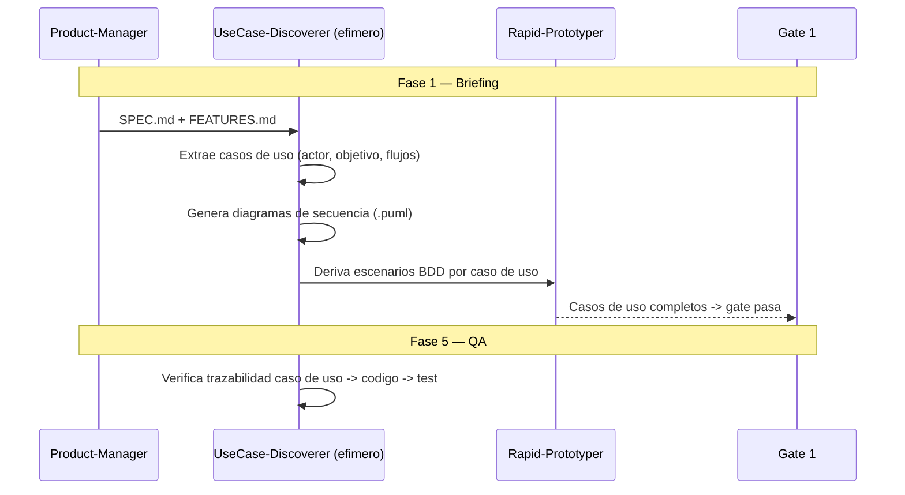

# UDD — Use-Case-Driven Development

**Version:** 1.0 | **Fecha:** 2026-06-05 | **Gobernanza:** Constitucion X-DD v1.5

---

## Indice

1. [Que es UDD en X-DD](#1-que-es-udd-en-x-dd)
2. [Cuando aplicar](#2-cuando-aplicar)
3. [Artefactos de entrada y salida](#3-artefactos-de-entrada-y-salida)
4. [UDD en el pipeline](#4-udd-en-el-pipeline)
5. [Integracion con otras disciplinas](#5-integracion-con-otras-disciplinas)
6. [Criterios de exito](#6-criterios-de-exito)
7. [Definition of Done UDD](#7-definition-of-done-udd)
8. [Agentes involucrados](#8-agentes-involucrados)
9. [Fuentes](#9-fuentes)

---

## 1. Que es UDD en X-DD

Use-Case-Driven Development es la disciplina donde los casos de uso son la unidad de diseno y
planificacion, por encima de las features. Un caso de uso describe una interaccion completa
actor-sistema con su objetivo, precondiciones, flujo principal y flujos alternativos.

En X-DD, UDD opera en la Fase 1 (Briefing), complementando a FDD: mientras FDD cataloga
features, UDD modela la interaccion transaccional completa. Se ejecuta mediante una skill
nueva (`/evol use-case-driven`). Produce `usecases/*/usecase.json`, `usecases/*/diagram.puml`
y `usecases/*/test_scenarios.feature`.

El principio de UDD en X-DD: en dominios transaccionales, la unidad de razonamiento es el
caso de uso completo (con sus alternativos y excepciones), no la feature aislada. Cada caso
de uso es trazable desde el objetivo del actor hasta el codigo y sus escenarios BDD.

> **executor (registro):** skill nueva [`use-case-driven`](../../.agent/workflows/use-case-driven.md)
> (gap, sin cobertura previa). **Activacion por profile:** se inyecta cuando `evol.profile.yml`
> declara `udd` en `methodologies:`.

---

## 2. Cuando aplicar

| Perfil | Aplica | Motivo |
|--------|:------:|--------|
| Aplicacion transaccional (banca, reservas) | SI | Interacciones complejas con alternativos |
| Modernizacion de legacy | SI | Los casos de uso documentan el comportamiento existente |
| Sistema con actores y roles multiples | SI | El caso de uso clarifica responsabilidades |
| Tool / script simple | NO | Sin interacciones actor-sistema relevantes |

---

## 3. Artefactos de entrada y salida

| Direccion | Artefacto | Descripcion |
|-----------|-----------|-------------|
| Entrada | `docs/specs/SPEC.md` | Requisitos del sistema |
| Entrada | `docs/features/FEATURES.md` | Features que se agrupan en casos de uso |
| Salida | `usecases/*/usecase.json` | Caso de uso (actor, objetivo, flujos principal/alternativo) |
| Salida | `usecases/*/diagram.puml` | Diagrama de secuencia del caso de uso |
| Salida | `usecases/*/test_scenarios.feature` | Escenarios BDD derivados del caso de uso |

---

## 4. UDD en el pipeline

### UDD por fase

| Fase | Actividad UDD | Estado esperado |
|------|---------------|-----------------|
| Fase 1 — Briefing | Extraer casos de uso + diagramas + escenarios | Casos de uso con flujos completos |
| Fase 3 — Plan | Planificar por caso de uso (no solo por feature) | Trazabilidad caso de uso -> tarea |
| Fase 4 — Build | Implementar el flujo principal y los alternativos | Codigo cubre todos los flujos |
| Fase 5 — QA | Ejecutar escenarios BDD del caso de uso | 100% escenarios pasando |

---

## 5. Integracion con otras disciplinas

| Disciplina | Relacion |
|------------|----------|
| [FDD](./FDD.md) | Los features se agrupan en casos de uso |
| [BDD](./BDD.md) | Los escenarios BDD se derivan de los flujos del caso de uso |
| [SDD](./SDD.md) | Los casos de uso trazan a REQ-NNN |
| [UXDD](./UXDD.md) | Los journeys de UX enmarcan los casos de uso con UI |

---

## 6. Criterios de exito

- Trazabilidad automatica desde el caso de uso hasta el codigo y sus tests.
- Cada caso de uso documenta flujo principal y flujos alternativos/excepciones.
- Cada caso de uso tiene su diagrama de secuencia.
- Los escenarios BDD cubren todos los flujos del caso de uso.

---

## 7. Definition of Done UDD

| Criterio | Verificacion |
|----------|-------------|
| `usecase.json` por caso de uso | `ls usecases/*/usecase.json` |
| Diagrama de secuencia | `ls usecases/*/diagram.puml` |
| Flujos alternativos documentados | Revision del `usecase.json` |
| Escenarios BDD derivados | `ls usecases/*/test_scenarios.feature` |

---

## 8. Agentes involucrados

| Agente | Rol en UDD |
|--------|------------|
| `Product-Manager` | Valida que los casos de uso representan el negocio |
| `UseCase-Discoverer` (efimero) | Extrae casos de uso, diagramas y escenarios |
| `Architect` | Verifica coherencia de los flujos con el dominio |
| `Builder` | Implementa flujo principal y alternativos |
| `QA-Reviewer` | Ejecuta los escenarios BDD del caso de uso |

---

## 9. Fuentes

Respaldo bibliografico de la disciplina (verificadas via `/evol fact-check`).

| Tipo | Fuente | Aporte |
|------|--------|--------|
| Origen del concepto | [Use Case — Wikipedia](https://en.wikipedia.org/wiki/Use_case) | Origen (Ivar Jacobson) y estructura del caso de uso |
| Evolucion | [Use-Case 2.0 — Ivar Jacobson International](https://www.ivarjacobson.com/publications/white-papers/use-case-ebook) | Version moderna del metodo (use-case slices) |
| Practica RUP | [Use Case Driven Development — RUP (Linkoping)](https://www.ida.liu.se/~TDDD63/lectures/Use%20Case%20Driven%20Development%20-%20RUP.pdf) | Work products, tasks y guias detalladas |
| Ejemplo | [Use Case Driven Development](https://github.com/Giannoudis/UseCaseDrivenDevelopment) | Implementacion de desarrollo dirigido por casos de uso |

> **Mantenido por:** Product-Manager + Architect
> **Gobernado por:** Constitucion X-DD v1.5, Art. 2
> **Ver tambien:** [FDD.md](./FDD.md) | [BDD.md](./BDD.md) | [UXDD.md](./UXDD.md) | [INDEX.md](./INDEX.md)
