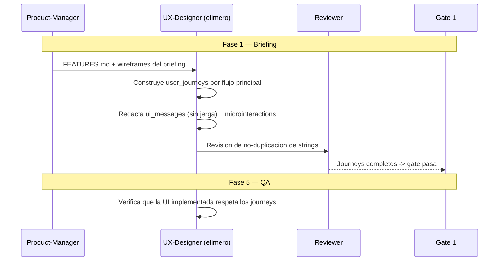

# UXDD — UX-Driven Development

**Version:** 1.0 | **Fecha:** 2026-06-05 | **Gobernanza:** Constitucion Evol-DD v1.5

---

## Indice

1. [Que es UXDD en Evol-DD](#1-que-es-uxdd-en-evol-dd)
2. [Cuando aplicar](#2-cuando-aplicar)
3. [Artefactos de entrada y salida](#3-artefactos-de-entrada-y-salida)
4. [UXDD en el pipeline](#4-uxdd-en-el-pipeline)
5. [Integracion con otras disciplinas](#5-integracion-con-otras-disciplinas)
6. [Criterios de exito](#6-criterios-de-exito)
7. [Definition of Done UXDD](#7-definition-of-done-uxdd)
8. [Agentes involucrados](#8-agentes-involucrados)
9. [Fuentes](#9-fuentes)

---

## 1. Que es UXDD en Evol-DD

UX-Driven Development es la disciplina donde los flujos de usuario, las microinteracciones y
los mensajes de la interfaz se especifican antes de escribir cualquier codigo frontend. La
experiencia se disena como artefacto, no se improvisa durante la implementacion.

En Evol-DD, UXDD opera en la Fase 1 (Briefing), alimentandose del catalogo de features (FDD) y
de los wireframes que produce el briefing. Se ejecuta mediante una skill nueva
(`/evol ux-driven`). Produce `ux/user_journeys/*.json`, `ux/ui_messages/*.md` y
`ux/microinteractions/*.yaml`.

El principio de UXDD en Evol-DD: todo flujo principal tiene un user journey definido antes del
codigo, y los mensajes de error no contienen jerga tecnica. La experiencia es parte del
contrato del producto, no un detalle de implementacion.

> **executor (registro):** skill nueva [`ux-driven`](../../.agent/workflows/ux-driven.md)
> (gap, sin cobertura previa; complementa al briefing y `design-system-builder`). **Activacion
> por profile:** se inyecta cuando `evol.profile.yml` declara `uxdd` en `methodologies:`.

---

## 2. Cuando aplicar

| Perfil | Aplica | Motivo |
|--------|:------:|--------|
| Webapp con interfaz compleja | SI | La UX es diferenciadora |
| App movil | SI | Microinteracciones y flujos criticos |
| Dashboard / producto data-heavy | SI | La presentacion guia la comprension |
| API/servicio sin UI | NO | Sin superficie de experiencia de usuario |

---

## 3. Artefactos de entrada y salida

| Direccion | Artefacto | Descripcion |
|-----------|-----------|-------------|
| Entrada | `docs/features/FEATURES.md` | Catalogo de features (desde FDD) |
| Entrada | `acuerdos/wireframes/*.html` | Wireframes del briefing |
| Salida | `ux/user_journeys/*.json` | Flujos de usuario con estados y emociones |
| Salida | `ux/ui_messages/*.md` | Mensajes de UI sin jerga tecnica |
| Salida | `ux/microinteractions/*.yaml` | Microinteracciones y feedback de UI |

---

## 4. UXDD en el pipeline

### UXDD por fase

| Fase | Actividad UXDD | Estado esperado |
|------|----------------|-----------------|
| Fase 1 — Briefing | Disenar journeys, mensajes y microinteracciones | Journey por flujo principal |
| Fase 4 — Build | Implementar la UI conforme a los journeys | UI conforme al diseno |
| Fase 5 — QA | Verificar que los flujos implementados coinciden | 0 divergencias de flujo |

---

## 5. Integracion con otras disciplinas

| Disciplina | Relacion |
|------------|----------|
| [FDD](./FDD.md) | Los features definen que flujos disenar |
| [BDD](./BDD.md) | Los escenarios incluyen pasos de UX observables |
| [A11yDD](./A11yDD.md) | Los criterios WCAG se validan sobre los componentes UX |
| [UDD](./UDD.md) | Los casos de uso enmarcan los journeys |

---

## 6. Criterios de exito

- Todo flujo principal tiene un `user_journey.json`.
- Los mensajes de error no contienen jerga tecnica.
- No hay strings de UI duplicados (un solo origen por mensaje).
- Las microinteracciones criticas estan especificadas con su feedback.

---

## 7. Definition of Done UXDD

| Criterio | Verificacion |
|----------|-------------|
| Journey por flujo principal | `ls ux/user_journeys/*.json` |
| Mensajes sin jerga tecnica | Revision de `ux/ui_messages/*.md` |
| Sin duplicacion de strings | Chequeo de unicidad de mensajes |
| Microinteracciones especificadas | `ls ux/microinteractions/*.yaml` |

---

## 8. Agentes involucrados

| Agente | Rol en UXDD |
|--------|-------------|
| `Product-Manager` | Valida que los journeys representan el negocio |
| `UX-Designer` (efimero) | Construye journeys, mensajes y microinteracciones |
| `UX` (core) | Aporta investigacion de usuario y validacion |
| `Builder` | Implementa la UI conforme a los journeys |
| `Reviewer` | Audita la no-duplicacion y la ausencia de jerga |

---

## 9. Fuentes

Respaldo bibliografico de la disciplina (verificadas via `/evol fact-check`).

| Tipo | Fuente | Aporte |
|------|--------|--------|
| Metodo | [User Journey Maps — Nielsen Norman Group](https://www.nngroup.com/articles/journey-mapping-101/) | Metodologia canonica de journey mapping |
| Mensajes | [Error Message Guidelines — Nielsen Norman Group](https://www.nngroup.com/articles/error-message-guidelines/) | Como redactar mensajes de error sin jerga |
| Libro | [Successful User Experience — Kuniavsky (Elsevier)](https://shop.elsevier.com/books/successful-user-experience/kuniavsky/978-0-443-29083-1) | Estrategias y hojas de ruta de UX |
| Kit agentico | [ux-ui-agent-skills](https://github.com/plugin87/ux-ui-agent-skills) | Habilidades para convertir un agente LLM en experto UX/UI |

> **Mantenido por:** UX + Product-Manager
> **Gobernado por:** Constitucion Evol-DD v1.5, Art. 2
> **Ver tambien:** [FDD.md](./FDD.md) | [A11yDD.md](./A11yDD.md) | [UDD.md](./UDD.md) | [INDEX.md](./INDEX.md)
