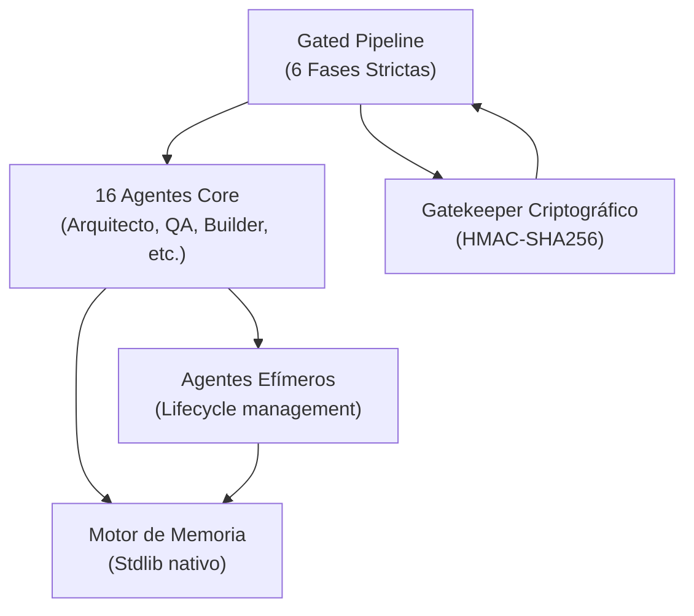

# Guía de Integración Arquitectónica (Evol-DD)

Evol-DD es un sistema independiente construido desde cero con decisiones arquitectónicas orientadas a la escalabilidad, la seguridad por diseño (SecDD) y la autonomía de agentes sin dependencias externas complejas.

Esta guía documenta los pilares arquitectónicos que permiten su integración fluida en cualquier ecosistema de software y el comportamiento interno de sus agentes.

---

## Patrones Arquitectónicos Base

| Dimensión | Enfoque en Evol-DD |
|---|---|
| **Integración Nativa MCP** | Soporte profundo para el Model Context Protocol (MCP). Permite extensibilidad ilimitada al estandarizar la conexión con herramientas externas y memorias contextuales. |
| **Escala de Agentes** | 17 agentes core permanentes (registrados en `AGENTS.md`) + agentes efímeros gestionados por ciclo de vida (`evol-agent-lifecycle.py`). |
| **Flujo de Código** | GitFlow estructurado e integrado (`main`, `develop`, `feat/`, `fix/`, `release/`). Validaciones strictas en hooks de pre-commit y gates. |
| **Aislamiento Criptográfico** | Scope de Gate Key estrictamente local por proyecto (`.evol/.gate-key`). Aprobaciones auditables mediante HMAC-SHA256 (`.evol/.gate-log.jsonl`). |
| **Memoria Nativa** | Motor nativo de memoria (`scripts/evol-memory.py`) sin bases de datos externas obligatorias. Invocación automatizada mediante hooks de ciclo de vida. |
| **Perfiles de Extensibilidad** | Jerarquía de perfiles: `minimal` < `core` < `developer`/`security`/`research` < `full`. |

---

## Principios Fundamentales del Pipeline

### Gated Pipeline
Evol-DD estructura el ciclo de desarrollo en fases inmutables: **Briefing**, **Spec**, **Plan**, **Build**, **QA**, **Retro**. 
Toda transición requiere la firma criptográfica (HMAC-SHA256) de un desarrollador humano responsable.

### Conventional Commits Estrictos
El framework asume y refuerza el estándar Conventional Commits. Todo commit que no satisfaga esta convención será bloqueado por los `git hooks` preconfigurados, garantizando un CHANGELOG determinista.

### Estándar de Documentación (DOC_STANDARD)
La documentación generada por los agentes core debe adherirse al estricto `DOC_STANDARD`:
- Cero abstracciones emocionales.
- Uso mandatorio de diagramas Mermaid para representación de flujos.
- Tablas para datos matriciales estructurados.
- Profundidad técnica sustantiva con fuentes verificables.

### Evals Universales
El sistema de validación de capacidades (`evol-eval.py`) emplea 4 calificadores universales: `structural`, `behavioral`, `output_match`, y `pass_at_k`.

---

## Arquitectura de Ciclo de Vida de Agentes

Evol-DD favorece la eficiencia descartando el modelo de catálogos masivos. En su lugar, utiliza un enfoque de **16 Especialistas Core** combinados con agentes desechables.

Los agentes adicionales son **efímeros**:
- Se instancian dinámicamente mediante `evol-agent-lifecycle.py create`.
- Operan bajo un TTL (Time-To-Live) estricto.
- Al completarse la tarea o expirar el TTL, se retiran a la carpeta `.evol/agents/retired/`.
- Su conocimiento (el `prompt` fundacional) se preserva bajo un hash SHA-256 para auditorías futuras, permitiendo instanciación repetible ("recall").

---

## Modelo de Memoria Contextual

El motor conversacional opera sin dependencias en herramientas externas, integrándose al ecosistema mediante hooks:

1. **`session:start:context-load`**: Inyecta el estado y prioridades de `memoria.md` al contexto local de trabajo al inicio del flujo.
2. **`stop:pattern-extraction`**: Invoca el motor de compactación al concluir la sesión, destilando el historial (`dialog/`) para abstraer convenciones y aprendizajes hacia la carpeta persistente `acuerdos/memoria/`.

---

## Diagrama Funcional del Ecosistema

---

## Cobertura de Disciplinas (-Driven Development)

El orquestador de Evol-DD aplica dinámicamente 31 disciplinas (9 de base y 22 extendidas) de acuerdo al perfil activo del proyecto.

El registro canónico con la fase correspondiente, ejecutor asignado y fuentes literarias de referencia reside en [`docs/disciplinas/INDEX.md`](./disciplinas/INDEX.md).

### Principales Disciplinas Base

| Disciplina | Archivo Descriptivo | Fase de Entrada |
|---|---|---|
| SDD — Spec-Driven | [docs/disciplinas/SDD.md](disciplinas/SDD.md) | Briefing → Spec |
| FDD — Feature-Driven | [docs/disciplinas/FDD.md](disciplinas/FDD.md) | Spec → Plan |
| DDD — Domain-Driven | [docs/disciplinas/DDD.md](disciplinas/DDD.md) | Spec |
| BDD — Behavior-Driven | [docs/disciplinas/BDD.md](disciplinas/BDD.md) | Plan → Build |
| ATDD — Acceptance TDD | [docs/disciplinas/ATDD.md](disciplinas/ATDD.md) | Plan → Build |
| TDD — Test-Driven | [docs/disciplinas/TDD.md](disciplinas/TDD.md) | Build |
| STDD — Security-Test-Driven | [docs/disciplinas/STDD.md](disciplinas/STDD.md) | Build → QA |
| SecDD — Security-Driven | [docs/disciplinas/SecDD.md](disciplinas/SecDD.md) | Build → QA |
| Threat-Driven | [docs/disciplinas/THREAT-DRIVEN.md](disciplinas/THREAT-DRIVEN.md) | Spec + QA |

Para una visión completa de dependencias y flujos inyectados por cada disciplina, refiérase al Índice Maestro.
