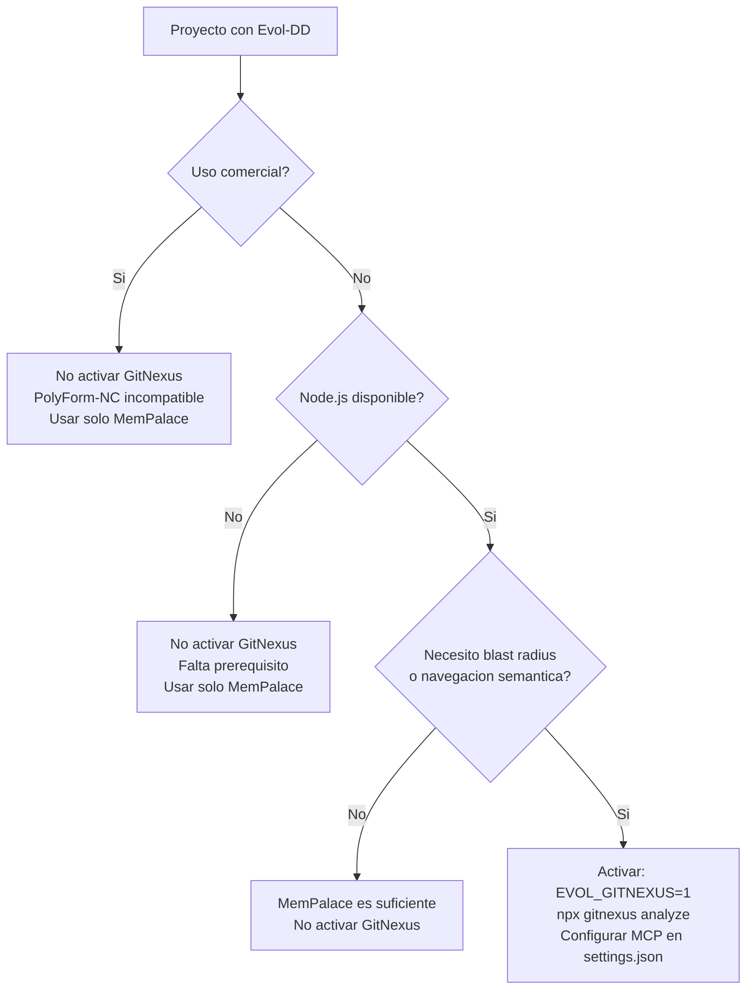

# GitNexus — Opt-in en Evol-DD

GitNexus es una herramienta de indexacion semantica de codigo que genera un grafo de llamadas, relaciones entre simbolos y flujos de ejecucion del codebase. En Evol-DD es **opt-in**: esta deshabilitado por defecto debido a restricciones de licencia.

## Que es GitNexus

GitNexus analiza el codigo fuente del proyecto y construye un indice persistente con:

- Grafo de simbolos: funciones, clases, metodos y sus relaciones de llamada
- Blast radius: dado un simbolo, calcula que otros simbolos y flujos se ven afectados si cambia
- Rename seguro: renombra simbolos en todo el codebase respetando el grafo de llamadas
- Flujos de ejecucion: secuencias de pasos agrupados por proceso, no por archivo

GitNexus expone sus capacidades a traves de herramientas MCP (`gitnexus_impact`, `gitnexus_query`, `gitnexus_context`, `gitnexus_rename`, `gitnexus_detect_changes`) y recursos (`gitnexus://repo/<nombre>/context`).

## Por que es opt-in

La licencia de GitNexus es **PolyForm Noncommercial**. Esta licencia prohibe el uso en proyectos con fines comerciales. Es incompatible con proyectos de producto, consultorias o cualquier uso donde el software sea parte de una actividad economica.

Evol-DD opera sin MCP por defecto (politica anti-MCP). GitNexus requiere MCP para exponer sus herramientas al agente. Activar GitNexus implica:

1. Habilitar MCP en el proyecto (rompe la politica anti-MCP del framework)
2. Aceptar los terminos de la licencia PolyForm-NC

Por estas razones, `evol.config.yml` establece `gitnexus.enabled: false` como valor por defecto.

## Relacion con MemPalace

MemPalace (MIT) es la capa de memoria conversacional por defecto de Evol-DD. GitNexus y MemPalace son complementarios y cubren dominios distintos:

| Dimension | MemPalace | GitNexus |
|---|---|---|
| Que indexa | Conversaciones, sesiones, artefactos de texto | Codigo fuente: funciones, clases, flujos |
| Licencia | MIT (uso libre, comercial incluido) | PolyForm-NC (solo no-comercial) |
| Dependencias | Python stdlib + CLI `mempalace` | Node.js + MCP |
| Activacion | Por defecto en perfil `core` y superiores | Solo con `EVOL_GITNEXUS=1` |
| Tipo de contexto | Historial conversacional y notas de sesion | Estructura del codigo y grafo de llamadas |
| Persistencia | Archivos Markdown en `memory/` | Indice propietario en `.gitnexus/` |

En proyectos no-comerciales, ambas herramientas pueden coexistir: MemPalace provee continuidad conversacional y GitNexus provee inteligencia estructural del codigo.

## Como activar

GitNexus se activa con la variable de entorno `EVOL_GITNEXUS=1`. Esta variable es leida por `evol-doctor.sh` y por `evol-agent-lifecycle.py` para ajustar el comportamiento del sistema.

```bash
# Activar para la sesion actual
export EVOL_GITNEXUS=1

# Activar de forma permanente en el proyecto
echo "EVOL_GITNEXUS=1" >> .env
```

Tambien se puede configurar en `evol.config.yml`:

```yaml
gitnexus:
  enabled: true
  license: PolyForm-NC
  commercial_use: false  # DEBE ser false segun licencia
```

### Prerequisitos

Antes de activar GitNexus, verificar:

1. Node.js >= 18 instalado (`node --version`)
2. El proyecto tiene un MCP server de GitNexus configurado en `.claude/settings.json`
3. El indice ha sido generado (`npx gitnexus analyze` en la raiz del proyecto)
4. El proyecto es de uso no-comercial

```bash
# Generar el indice inicial
npx gitnexus analyze

# Verificar que el indice esta actualizado
npx gitnexus status
```

## Que aporta al sistema cuando esta activo

Cuando `EVOL_GITNEXUS=1`, los agentes core de Evol-DD pueden usar las capacidades de GitNexus de la siguiente forma:

| Agente | Capacidad adicional con GitNexus |
|---|---|
| evol-analyst | Calcula blast radius real via `gitnexus_impact` antes de reportar riesgo de cambio |
| evol-architect | Consulta flujos de ejecucion existentes con `gitnexus_query` para decisiones de refactorizacion |
| evol-reviewer | Detecta simbolos afectados por el diff con `gitnexus_detect_changes` |
| evol-agent-factory | Verifica impacto de agentes efimeros sobre el grafo de llamadas antes de crearlos |
| evol-researcher | Navega el codebase por concepto (`gitnexus_query`) en lugar de grep |

## Limitaciones

Las siguientes limitaciones aplican independientemente de si el proyecto es comercial o no:

- **Indice puede estar stale**: si el codigo cambia y no se re-ejecuta `npx gitnexus analyze`, las herramientas pueden retornar resultados desactualizados. El indice no se regenera automaticamente en Evol-DD.
- **Requiere Node.js**: a diferencia del resto del stack (Python + Bash), GitNexus depende de Node.js. Proyectos en entornos sin Node.js no pueden usarlo.
- **Requiere MCP activo**: las herramientas de GitNexus se exponen por MCP. Evol-DD en modo anti-MCP (default) no puede acceder a ellas aunque el indice exista.
- **Solo proyectos no-comerciales**: la licencia PolyForm-NC prohibe explicitamente el uso en proyectos comerciales. Usar GitNexus en un proyecto comercial viola la licencia.
- **Sin soporte en codex global**: el adaptador de codex (`~/.codex/skills/evol-orchestrator/`) no tiene acceso a GitNexus porque es un directorio global sin MCP configurado por proyecto.

## Verificacion del estado

`evol-doctor.sh --json` incluye el estado de GitNexus en su salida:

```bash
bash scripts/evol-doctor.sh --json | python3 -m json.tool
```

La salida JSON contendra una entrada con `check: "gitnexus_mode"` indicando si esta activo o no, y si el indice fue encontrado.

Sin `--json`, el doctor muestra:

```
[INFO] GitNexus: disabled (EVOL_GITNEXUS not set)
```

o, si esta activo:

```
[OK] GitNexus: enabled, index found at .gitnexus/
[INFO] GitNexus: PolyForm-NC license — non-commercial use only
```

## Diagrama de decision para activacion


