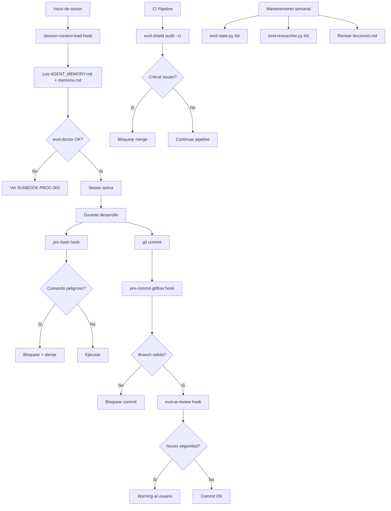

# Monitoreo del Sistema — Evol-DD

Revision: 2026-06-02
Alcance: estado operacional del framework y los proyectos que administra

---

## Metricas del sistema

| Metrica                              | Fuente                                     | Comando de consulta                                                                 | Umbral warning                  | Accion ante warning                                              |
|--------------------------------------|--------------------------------------------|-------------------------------------------------------------------------------------|----------------------------------|------------------------------------------------------------------|
| Instincts acumulados                 | `~/.evol/state.db` tabla `instincts`       | `python scripts/evol-state.py list --count`                                         | > 500 instincts activos          | Ejecutar `evol-state.py prune --older-than 180`                 |
| Research proposals pendientes        | `~/.evol/state.db` tabla `proposals`       | `python scripts/evol-researcher.py list --status pending --count`                   | > 20 proposals sin revisar       | Revisar y aplicar o descartar con `evol-researcher.py review`   |
| Lecciones con mejoras pendientes     | `lecciones.md` secciones sin estado DONE   | `grep -c "pendiente\|TODO\|sin_aplicar" lecciones.md`                               | > 5 lecciones sin aplicar        | Ejecutar `/cierre-fase` o aplicar mejoras manualmente           |
| Agentes efimeros activos             | `registry.json` campo `lifecycle=ephemeral, status=active` | `python scripts/evol-agent-lifecycle.py list --active --count`     | > 10 agentes efimeros activos    | Revisar si alguno debe ser retirado con `lifecycle retire`       |
| Tamano de AGENT_MEMORY.md            | Filesystem local                           | `wc -l AGENT_MEMORY.md` / `du -sh AGENT_MEMORY.md`                                 | > 500 lineas o > 100 KB          | Condensar con `evol-memory.py condense` o archivar secciones    |
| Dias desde ultimo cierre-fase        | `memoria.md` campo `ultima_fase_cerrada`   | `python scripts/evol-gate.py status --last-close-days`                              | > 14 dias sin cierre             | Ejecutar `/cierre-fase` para actualizar lecciones y memoria     |
| Issues criticos evol-shield          | Output de `evol-shield.py audit`           | `python scripts/evol-shield.py audit --ci --json \| jq '.critical_count'`           | > 0 issues criticos              | Revisar y resolver antes de cualquier release o gate transition  |

---

## Health check completo

El script `evol-doctor.sh --json` es el punto de entrada principal para verificar el estado del sistema. Produce una salida JSON estructurada con los siguientes campos clave:

```bash
bash scripts/evol-doctor.sh --json
```

Campos relevantes en la salida JSON:

| Campo JSON                        | Tipo    | Descripcion                                                    | Valor esperado        |
|-----------------------------------|---------|----------------------------------------------------------------|-----------------------|
| `status`                          | string  | Estado global del health check                                 | `"ok"`                |
| `checks.gate_key_exists`          | boolean | La clave HMAC del proyecto existe y no esta vacia              | `true`                |
| `checks.gate_key_gitignored`      | boolean | `.evol/.gate-key` esta en `.gitignore`                         | `true`                |
| `checks.registry_valid`           | boolean | `registry.json` pasa validacion con `--strict`                 | `true`                |
| `checks.hooks_installed`          | boolean | Hooks de git (gitflow, pre-bash) estan instalados              | `true`                |
| `checks.llm_provider_reachable`   | boolean | El proveedor LLM configurado responde (solo si no es mock)     | `true` o `"skipped"`  |
| `checks.state_db_accessible`      | boolean | `~/.evol/state.db` es legible y tiene schema correcto          | `true`                |
| `checks.no_mcp_refs`              | boolean | Ningun artefacto generado contiene referencias a mcpServers    | `true`                |
| `checks.skills_valid`             | boolean | Todos los skills en `skills/` tienen `SKILL.md` valido         | `true`                |
| `warnings`                        | array   | Lista de advertencias no bloqueantes                           | `[]`                  |
| `errors`                          | array   | Lista de errores que requieren atencion                        | `[]`                  |

Para parsear la salida en scripts de CI:

```bash
DOCTOR_STATUS=$(bash scripts/evol-doctor.sh --json | python3 -c "import sys,json; d=json.load(sys.stdin); print(d['status'])")
if [ "$DOCTOR_STATUS" != "ok" ]; then
  echo "ERROR: evol-doctor reporta estado: $DOCTOR_STATUS"
  exit 1
fi
```

---

## Frecuencia recomendada de checks

| Check                                  | Frecuencia          | Metodo                                          |
|----------------------------------------|---------------------|-------------------------------------------------|
| Health check completo (`evol-doctor`)  | Al inicio de sesion | Manual o hook `session-context-load`            |
| Instincts y proposals                  | Semanal             | Manual: `evol-state.py list` + `evol-researcher.py list` |
| Shield audit                           | Por PR/merge        | CI: `evol-shield.py audit --ci`                 |
| Tamano de AGENT_MEMORY.md              | Cada 5 sesiones     | Manual o automatico via `mempalace-index` hook  |
| Dias desde cierre-fase                 | Semanal             | Manual: revisar `memoria.md`                    |
| Lecciones pendientes                   | Al abrir sprint     | Manual: `grep pendiente lecciones.md`           |

---

## Diagrama del flujo de monitoreo



---

## Alertas de seguridad prioritarias

Los siguientes eventos deben tratarse como incidentes y escalar inmediatamente:

1. `evol-shield.py audit` reporta `critical_count > 0` — indica rutas absolutas, secrets o referencias MCP en artefactos generados.
2. `git log -- .evol/.gate-key` muestra el archivo en algun commit — la clave fue expuesta; ejecutar PROC-004.
3. `evol-doctor.sh` reporta `gate_key_gitignored: false` — riesgo de exposicion de clave; agregar a `.gitignore` inmediatamente.
4. Cualquier archivo en `dialog/` o `tool_result/` con antiguedad > 3 dias que no haya sido limpiado por el GC — puede contener datos sensibles de sesion.
