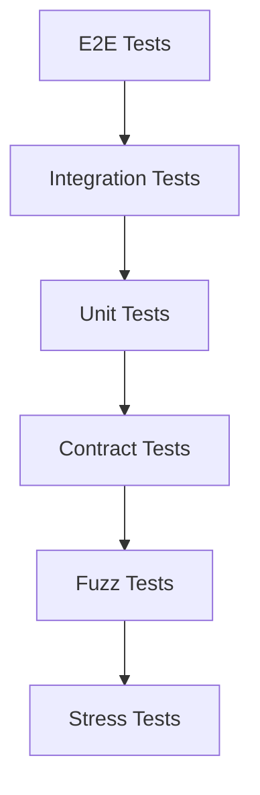
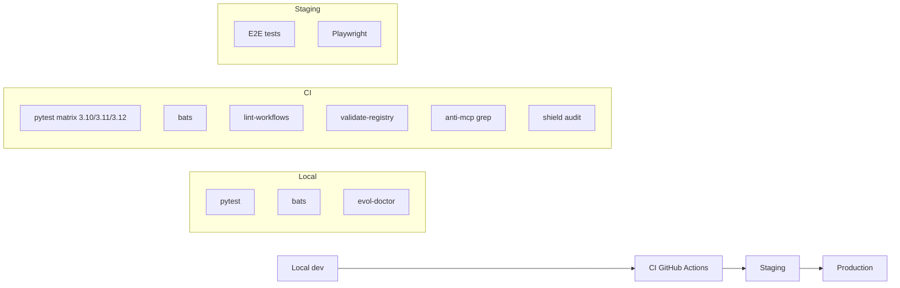

# Plan de Calidad — Evol-DD

## Resumen

Este documento define la estrategia de testing, los criterios de aceptacion, y los gates de calidad para el framework Evol-DD.

## Estrategia de Testing

### Piramamide de Testing



| Nivel | Cobertura Objetivo | Responsable | Frecuencia |
|-------|--------------------|--------------|------------|
| Unitario | 80% | evol-qa | Cada commit |
| Integracion | 60% | evol-qa | Cada PR |
| E2E | 40% | evol-qa | Cada release |
| Contrato | 50% | evol-qa | Cada PR |
| Fuzz | TBD | evol-sec | Semanal |
| Stress | TBD | evol-devops | Pre-release |

### Mapa de Tipos de Prueba

| Tipo | Agente | Herramienta | Comando |
|------|--------|-------------|---------|
| Unitario Python | evol-qa | pytest | `pytest tests/` |
| Unitario Shell | evol-qa | bats | `bats tests/*.bats` |
| E2E | evol-qa | playwright | `playwright test` |
| Contrato (Pact) | evol-qa | Pact | `pact-cli verify` |
| Eval harness | evol-qa / evol-reviewer | evol-eval.py | `evol eval run --suite=NAME` |
| Flow gate | evol-qa | evol-flow.py | `evol flow run --flow .evol/build/flow.json` |
| SAST | evol-sec | semgrep | `semgrep --config auto` |
| SCA | evol-sec | trivy | `trivy fs .` |
| Secrets | evol-sec | gitleaks | `gitleaks detect` |
| Audit framework | evol-sec | evol-shield.py | `evol shield audit --ci` |
| Fuzz | evol-sec | sandbox | workflow `pruebas-fuzz` |
| Stress | evol-devops | sandbox | workflow `stress-test` |

## Casos de Prueba

### CP-001: Bootstrap de Proyecto

| Campo | Valor |
|-------|-------|
| ID | CP-001 |
| Prioridad | ALTA |
| Feature | Bootstrap |
| Precondicion | Directorio vacio, git instalado |
| REQ | REQ-001, REQ-002, REQ-003 |

#### Happy Path

```gherkin
Scenario: Bootstrap exitoso con perfil core
  Given directorio vacio "/tmp/test-evol"
  And git instalado en sistema
  When ejecuto "bash scripts/evol-init.sh /tmp/test-evol --profile=core"
  Then directorio contiene ".git"
  And archivo "memoria.md" existe
  And archivo ".gitignore" existe
  And archivo "evol.profile.yml" existe

Scenario: Bootstrap idempotente
  Given proyecto ya inicializado en "/tmp/test-evol"
  When ejecuto "bash scripts/evol-init.sh /tmp/test-evol --profile=core"
  Then no hay errores
  And archivos previos intactos

Scenario: Perfiles disponibles
  Given sin argumentos
  When ejecuto "bash scripts/evol-init.sh --list-profiles"
  Then lista de perfiles mostrada
  And perfiles incluyen: minimal, core, developer, full
```

#### Error Cases

```gherkin
Scenario: Directorio destino no especificado
  Given sin argumentos
  When ejecuto "bash scripts/evol-init.sh"
  Then mensaje de uso mostrado
  And exit code 1

Scenario: Perfil inexistente
  Given perfil "inexistente" no existe
  When ejecuto "bash scripts/evol-init.sh /tmp/test --profile=inexistente"
  Then mensaje de error con perfiles disponibles
  And exit code 1

Scenario: Git no instalado
  Given git no esta en PATH
  When ejecuto "bash scripts/evol-init.sh /tmp/test"
  Then evol-doctor.sh reporta error
  And exit code no 0
```

#### Edge Cases

```gherkin
Scenario Outline: Bootstrap con perfil <perfil>
  Given perfil "<perfil>"
  When ejecuto "bash scripts/evol-init.sh /tmp/test --profile=<perfil>"
  Then resultado "<resultado>"

  Examples:
    | perfil    | resultado |
    | minimal   | exito     |
    | core      | exito     |
    | developer | exito     |
    | security  | exito     |
    | research  | exito     |
    | full      | exito     |
    | lean      | error si no global |
    | invalid   | error     |
```

---

### CP-002: Ciclo de Vida de Agente Efimero

| Campo | Valor |
|-------|-------|
| ID | CP-002 |
| Prioridad | ALTA |
| Feature | Agent Lifecycle |
| REQ | REQ-004, REQ-005, REQ-006, REQ-007 |

#### Happy Path

```gherkin
Scenario: Crear agente efimero
  Given agent "test-agent" no existe
  When ejecuto "python3 scripts/evol-agent-lifecycle.py create --name test-agent --task 'Prueba' --expires-after 7"
  Then archivo "prompts/agents/ephemeral/*-test-agent.md" existe
  And registry contiene entrada para "test-agent"
  And mensaje "Agent created: test-agent" mostrado
  And MemPalace indexado

Scenario: Invocar agente
  Given agente "test-agent" existe
  When ejecuto "python3 scripts/evol-agent-lifecycle.py invoke test-agent"
  Then sessions_used incrementa en registry
  And mensaje "Agent invoked: test-agent" mostrado

Scenario: Retirar agente con snapshot SHA-256
  Given agente "test-agent" existe
  When ejecuto "python3 scripts/evol-agent-lifecycle.py retire test-agent"
  Then archivo .md eliminado de prompts/agents/ephemeral/
  And snapshot en ".evol/agents/retired/test-agent.json"
  And campo "prompt_sha256" presente en snapshot
  And campo "invocation_log" presente en snapshot
  And registry marca retired=true

Scenario: Recuperar agente
  Given agente "test-agent" retired
  When ejecuto "python3 scripts/evol-agent-lifecycle.py recall test-agent"
  Then archivo .md reconstruido en prompts/agents/ephemeral/
  And registry marca recalled=true
  And registry marca retired=false

Scenario: Listar agentes
  Given agentes existen
  When ejecuto "python3 scripts/evol-agent-lifecycle.py list --all"
  Then todos los agentes listados con categoria y estado
```

#### Error Cases

```gherkin
Scenario: Agent no existe para invoke
  Given agent "no-existe" no existe
  When ejecuto "python3 scripts/evol-agent-lifecycle.py invoke no-existe"
  Then mensaje "Agent not found: no-existe"
  And exit code 1

Scenario: Snapshot corrupto en recall
  Given snapshot con SHA-256 incorrecto
  When ejecuto "python3 scripts/evol-agent-lifecycle.py recall test-agent"
  Then mensaje "Snapshot integrity check FAILED"
  And exit code 1
  And hint "Use --force to override"

Scenario: Recall sin snapshot
  Given snapshot no existe
  When ejecuto "python3 scripts/evol-agent-lifecycle.py recall no-existe"
  Then mensaje "Snapshot not found"
  And exit code 1
```

#### Edge Cases

```gherkin
Scenario Outline: GC con expiracion <dias> dias
  Given creo agente con expires_after=<dias>
  When espero <dias+1> dias
  And ejecuto "python3 scripts/evol-agent-lifecycle.py gc"
  Then resultado "<resultado>"

  Examples:
    | dias | resultado        |
    | 1    | expirado         |
    | 30   | vigente          |
    | 0    | error validation |
    | -1   | error validation |

Scenario: Duplicar nombre de agente
  Given agente "test-agent" existe
  When ejecuto "create --name test-agent"
  Then mensaje de error por nombre duplicado
```

---

### CP-003: Gate Keeper HMAC-SHA256

| Campo | Valor |
|-------|-------|
| ID | CP-003 |
| Prioridad | ALTA |
| Feature | Gate Keeper |
| REQ | REQ-008, REQ-009, REQ-010 |

#### Happy Path

```gherkin
Scenario: Inicializar gate
  Given gate no existe
  When ejecuto "python3 scripts/evol-gate.py init"
  Then archivo ".evol/.gate-key" creado (chmod 600)
  And archivo ".evol/.gate-log.jsonl" creado
  And mensaje "Gate initialized" mostrado

Scenario: Aprobar fase
  Given gate inicializado
  When ejecuto "python3 scripts/evol-gate.py approve --phase spec --approver human"
  Then entrada en log con timestamp y phase
  And firma HMAC calculada y almacenada
  And mensaje "APROBADO: spec by human" mostrado

Scenario: Validar gate activo
  Given gate inicializado
  When ejecuto "python3 scripts/evol-gate.py validate"
  Then mensaje "Gate active"
  And exit code 0

Scenario: Transicion entre fases
  Given fase "build" activa
  When ejecuto "python3 scripts/evol-gate.py transition --from build --to qa"
  Then fase en log cambiada a "build -> qa"
  And mensaje "Transition: build -> qa" mostrado
```

#### Error Cases

```gherkin
Scenario: Validar gate no inicializado
  Given gate no existe
  When ejecuto "python3 scripts/evol-gate.py validate"
  Then mensaje "Gate not initialized. Run: evol-gate init"
  And exit code 1

Scenario: Approve sin init
  Given gate no existe
  When ejecuto "python3 scripts/evol-gate.py approve --phase spec"
  Then mensaje de error
  And exit code 1
```

---

### CP-004: Pipeline de 6 Fases

| Campo | Valor |
|-------|-------|
| ID | CP-004 |
| Prioridad | ALTA |
| Feature | Pipeline |
| REQ | REQ-011, REQ-012 |

#### Happy Path

```gherkin
Scenario: Transicion entre fases con APROBADO
  Given fase actual "build"
  And gate inicializado
  When solicito transicion a fase "qa"
  Then gate solicita "APROBADO"
  When confirmo "APROBADO"
  Then fase cambia a "qa" en memoria.md
  And entrada en log de gate

Scenario: Verificar estado actual
  Given fase "spec" activa
  When leo memoria.md
  Then campo "Fase X-DD activa" muestra "2-Spec"

Scenario: Pipeline completo
  Given fase "briefing" activa
  When ejecuto las 6 fases con APROBADO en cada transicion
  Then todas las fases completadas
  And memoria.md actualizada con hitos
  And lecciones.md actualizada con aprendizajes
```

#### Error Cases

```gherkin
Scenario: Transicion sin APROBADO
  Given fase "spec"
  When solicito transicion sin confirmar APROBADO
  Then transicion bloqueada
  And mensaje "APROBADO requerido" mostrado

Scenario: Fase invalida
  Given gate inicializado
  When ejecuto "python3 scripts/evol-gate.py approve --phase invalid-phase"
  Then mensaje de error con fases validas
```

---

### CP-005: Memoria Conversacional

| Campo | Valor |
|-------|-------|
| ID | CP-005 |
| Prioridad | MEDIA |
| Feature | Memory Engine |
| REQ | REQ-013, REQ-014, REQ-015 |

#### Happy Path

```gherkin
Scenario: Cargar memoria al iniciar sesion
  Given AGENT_MEMORY.md existe
  And journal de ayer existe
  When ejecuto "python3 scripts/evol-memory.py load"
  Then contenido AGENT_MEMORY.md mostrado
  And contenido journal ayer mostrado

Scenario: Persistir sesion en journal
  Given sesion terminada con messages.jsonl
  When ejecuto "python3 scripts/evol-memory.py summarize --messages session.jsonl"
  Then archivo "memory/YYYY-MM-DD.md" actualizado
  And entrada de sesion con timestamp

Scenario: Buscar en memoria
  Given conversaciones previas
  When ejecuto "python3 scripts/evol-memory.py search 'query'"
  Then resultados relevantes mostrados

Scenario: GC de tool results
  Given tool_result con archivos vencidos
  When ejecuto "python3 scripts/evol-memory.py gc --days 3"
  Then archivos con TTL vencido eliminados
```

#### Edge Cases

```gherkin
Scenario Outline: Compactar con <tokens> tokens
  Given historial con <tokens> tokens
  When ejecuto compact
  Then resultado "<resultado>"

  Examples:
    | tokens  | resultado        |
    | 50000  | sin compactar    |
    | 95000  | compactar        |
    | 150000 | compactar        |
```

---

### CP-006: Sistema de Lecciones

| Campo | Valor |
|-------|-------|
| ID | CP-006 |
| Prioridad | MEDIA |
| Feature | Lessons Engine |
| REQ | REQ-016, REQ-017, REQ-018 |

#### Happy Path

```gherkin
Scenario: Anadir leccion
  Given leccion valida
  When ejecuto "python3 scripts/evol-lessons.py add --titulo 'Test' --categoria PROCESO --contexto 'C' --problema 'P' --causa 'Ca' --leccion 'L' --aplica 'A'"
  Then leccion guardada en lecciones.md
  And deduplicacion fuzzy aplicada

Scenario: Buscar lecciones
  Given lecciones existentes
  When ejecuto "python3 scripts/evol-lessons.py search 'query'"
  Then lecciones relevantes mostradas con score

Scenario: Listar lecciones pendientes
  When ejecuto "python3 scripts/evol-lessons.py list --pendientes"
  Then solo lecciones con estado "pendiente" mostradas

Scenario: Suggest fix
  Given leccion existente
  When ejecuto "python3 scripts/evol-lessons.py suggest-fix 'titulo'"
  Then mejoras propuestas por LLM mostradas

Scenario: Apply fix
  Given leccion con mejoras pendientes
  When ejecuto "python3 scripts/evol-lessons.py apply-fix 'titulo' --fix 'implementacion'"
  Then estado cambia a "aplicado"
  And mejoras guardadas
```

---

## Matriz de Cobertura

| Requisito | CP-001 | CP-002 | CP-003 | CP-004 | CP-005 | CP-006 |
|-----------|--------|--------|--------|--------|--------|--------|
| REQ-001 | X | - | - | - | - | - |
| REQ-002 | X | - | - | - | - | - |
| REQ-003 | X | - | - | - | - | - |
| REQ-004 | - | X | - | - | - | - |
| REQ-005 | - | X | - | - | - | - |
| REQ-006 | - | X | - | - | - | - |
| REQ-007 | - | X | - | - | - | - |
| REQ-008 | - | - | X | - | - | - |
| REQ-009 | - | - | X | - | - | - |
| REQ-010 | - | - | X | X | - | - |
| REQ-011 | - | - | - | X | - | - |
| REQ-012 | - | - | - | X | - | - |
| REQ-013 | - | - | - | - | X | - |
| REQ-014 | - | - | - | - | X | - |
| REQ-015 | - | - | - | - | X | - |
| REQ-016 | - | - | - | - | - | X |
| REQ-017 | - | - | - | - | - | X |
| REQ-018 | - | - | - | - | - | X |

**Leyenda:**
- X = cubierto por caso de prueba
- Total cobertura objetivo: 100%

## Gates de Calidad

| Gate | Criterio | Bloquea merge | herramienta |
|------|----------|--------------|--------------|
| G1-Tests-Python | pytest tests/ 100% pass | SI | pytest |
| G2-Tests-Shell | bats tests/*.bats 100% pass | SI | bats |
| G3-Workflows-Lint | bash scripts/lint-workflows.sh OK | SI | bash |
| G4-Registry-Validate | python3 scripts/validate-registry.py --strict OK | SI | Python |
| G5-Manifests-Validate | jsonschema contra schemas/ OK | SI | python jsonschema |
| G6-Anti-MCP | grep mcpServers en artefactos = 0 | SI | grep |
| G7-Anti-Emoji | grep emojis en docs/ = 0 | SI | grep |
| G8-Shield-Audit | python3 scripts/evol-shield.py audit --ci OK | SI | evol-shield.py |
| G9-Init-Idempotent | bats tests/test_init_idempotent.bats OK | SI | bats |

## Entorno de Testing



| Entorno | Purposito | Reset | Who |
|---------|-----------|-------|-----|
| Local | Desarrollo rapido | Manual | Developer |
| CI | Validacion automatica | Cada PR | Bot |
| Staging | QA pre-release | Semanal | QA |
| Production | Release | Manual | DevOps |

## Responsabilidades

| Rol | Responsabilidad |
|-----|-----------------|
| evol-qa | Estrategia, casos, ejecucion, reportes |
| evol-reviewer | Peer review, quality gate, aprobacion |
| evol-sec | Security testing, audits, vulnerability management |
| evol-devops | CI/CD, automation, deployment |
| evol-analyst | Metricas, coverage, tendencias |

## Entregables

| Entregable | Frecuencia | Ubicacion |
|------------|------------|-----------|
| REPORTE_QA.md | Post-cada release | docs/qa/ |
| CHECKLIST_RELEASE.md | Pre-cada release | docs/qa/ |
| CASOS_BORDE.md | Post-cada feature | docs/qa/ |
| MATRIZ_TRAZABILIDAD.md | Actualizado con cada PR | docs/qa/ |

## Metricas de Calidad

| Metrica | Objetivo | Actual | Tendencia |
|---------|----------|--------|-----------|
| Coverage unit tests | 80% | TBD | - |
| Coverage integration | 60% | TBD | - |
| Defect density | < 5 por KLOC | TBD | - |
| Mean time to recover | < 1h | TBD | - |
| Security vulnerabilities | 0 CRITICAL | TBD | - |