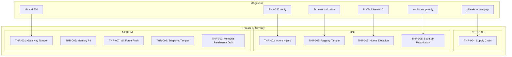

# Modelo de Amenazas — Evol-DD

## Resumen

Este documento aplica la metodologia STRIDE para identificar, categorizar y mitigar amenazas en el framework Evol-DD.

## Metodologia: STRIDE

| Categoria | Descripcion | Contramedida |
|-----------|-------------|--------------|
| Spoofing | Suplantacion de identidad | HMAC-SHA256 gates |
| Tampering | Modificacion no autorizada | Git hooks, signed commits |
| Repudiation | Negacion de acciones | Audit log en .evol/ |
| Information Disclosure | Exposicion de secretos | No secrets in code, gitleaks |
| Denial of Service | Indisponibilidad | Modo BASE sin Memoria Persistente |
| Elevation of Privilege | Escalada de permisos | No chmod 777, no root |

## Activos del Sistema

| Activo | Criticidad | Descripcion |
|--------|-----------|-------------|
| Gate key (.evol/.gate-key) | CRITICAL | Clave HMAC para approvals |
| Agent prompts | HIGH | Contenido de agentes incluyendo conocimiento |
| Registry (registry.json) | HIGH | Registro unificado de agentes |
| State database (state.db) | MEDIUM | Instincts, evolutions, proposals |
| Memoria Persistente index | MEDIUM | Indice semantico |
| Snapshot files (.evol/agents/retired/) | HIGH | Archivos JSON de agentes archivados |
| Scripts de hooks | HIGH | Codigo ejecutable en eventos |
| Skills externas | CRITICAL | Codigo de terceros |

## Matriz de Amenazas

| ID | Activo | Categoria STRIDE | Amenaza | Vector | Impacto | Mitigacion | Riesgo Residual | Evidencia |
|----|--------|------------------|---------|--------|---------|------------|-----------------|-----------|
| THR-001 | Gate key | Tampering | Modificacion de .evol/.gate-key por actor malicioso | Acceso filesystem | Falsificacion de approvals | chmod 600, gitignored, SHA-256 verification | LOW | evol-gate.py init set permissions |
| THR-002 | Agent prompts | Information Disclosure | Secuestro de agente para obtener conocimiento sensible | Acceso a prompts/agents/ | Exfiltracion de contexto proyecto | SHA-256 integrity en retire/recall | MEDIUM | evol-agent-lifecycle.py calcula SHA |
| THR-003 | Registry | Tampering | Registro corrupto o entries duplicadas | Edicion manual | Cascada de inconsistencias | Schema validation con JSON Schema | MEDIUM | validate-registry.py --strict |
| THR-004 | Skills externas | Spoofing | Supply chain attack via skill maliciosa | GitHub repositorio | Ejecucion de codigo arbitrario | gitleaks + semgrep scan antes de install | MEDIUM | evol-evolve.py install-skill con scan |
| THR-005 | Hooks scripts | Elevation of Privilege | Ejecucion no autorizada via hook | Modificacion de scripts | Ejecucion de comandos berbahaya | PreToolUse validation, Exit 2 blocks | LOW | hooks.json valida eventos |
| THR-006 | Memory data | Information Disclosure | PII expuesta en memoria del proyecto | Archivos memory/ | Violacion de privacidad | Encriptacion opt-in, gitignore dialog/ | LOW | tool_result/ y dialog/ gitignored |
| THR-007 | Git config | Tampering | Force push elimina historial | git push --force | Perdida de historial | pre-commit hook bloquea --force | LOW | pre:bash:dangerous-command.sh |
| THR-008 | State.db | Repudiation | Edicion manual oculta cambios | sqlite3 state.db (manual) | Trazabilidad perdida | Solo via evol-state.py API | MEDIUM | evol-state.py como unico accessor |
| THR-009 | Snapshots | Tampering | Modificacion de snapshot mientras archivado | Acceso filesystem | Recupacion de agente corrupto | SHA-256 verificado en recall, --force override | LOW | evol-agent-lifecycle.py recall integrity check |
| THR-010 | Memoria Persistente index | Denial of Service | Indice corrupto o no disponible | Fallo de memoria_persistente | Perdida de busqueda semantica | Modo BASE funciona sin Memoria Persistente | MEDIUM | memoria_persistente_safe() wrapper |

## Diagrama de Flujo de Amenazas

## Controles de Seguridad Implementados

| Control | Amenazas mitigadas | Implementacion | Evidencia |
|---------|-------------------|----------------|-----------|
| HMAC gate keys por proyecto | THR-001 | evol-gate.py init crea .evol/.gate-key | Lineas 45-52 evol-gate.py |
| SHA-256 integrity snapshots | THR-002, THR-009 | evol-agent-lifecycle.py retire calcula y guarda | Lineas 95-98, recall verifica |
| No secrets in code | THR-004, THR-006 | CI grep mcpServers=0, gitleaks | ci.yml step G6 |
| gitleaks en CI | THR-004 | evol-shield.py audit --ci | Lineas 89-99 shield.py |
| semgrep en CI | THR-004 | evol-shield.py audit --ci | Lineas 101-112 shield.py |
| GitFlow enforced | THR-007 | pre-commit-gitflow.sh | hooks.json ID pre:commit:gitflow |
| Anti-dangerous commands | THR-005 | pre-bash-dangerous-command.sh | Exit 2 para rm -rf/, --force |
| Schema validation registry | THR-003 | validate-registry.py --strict | Lineas 30-45 |
| Mode BASE sin Memoria Persistente | THR-010 | evol-doctor.sh detecta y opera | Lineas 34-41 doctor.sh |
| Snapshots archivados gitignored | THR-006, THR-009 | .gitignore exclude .evol/ | Lineas 16-19 .gitignore |

## Plan de Remediacion

| Prioridad | ID | Accion | Responsable | Deadline |
|-----------|-----|--------|--------------|----------|
| CRITICAL | THR-004 | Implementar gitleaks + semgrep pre-install en evol-evolve.py | evol-sec | Sprint actual |
| HIGH | THR-002 | Documentar verificacion SHA-256 en recall | evol-sec | Sprint actual |
| HIGH | THR-003 | Agregar hook de validacion post-edit registry | evol-sec | Backlog |
| MEDIUM | THR-008 | Crear wrapper read-only para state.db | evol-devops | Backlog |
| MEDIUM | THR-010 | Documentar degradacion completa en modos.md | evol-doc | Backlog |

## Evaluacion de Riesgo

### Matriz de Probabilidad vs Impacto

|  | Impacto LOW | Impacto MEDIUM | Impacto HIGH | Impacto CRITICAL |
|--|-------------|----------------|--------------|-----------------|
| Probabilidad HIGH | MEDIUM | HIGH | CRITICAL | CRITICAL |
| Probabilidad MEDIUM | LOW | MEDIUM | HIGH | CRITICAL |
| Probabilidad LOW | LOW | MEDIUM | MEDIUM | HIGH |
| Probabilidad VERY_LOW | LOW | LOW | MEDIUM | HIGH |

### Clasificacion Final

| Nivel | Amenazas | Accion inmediata |
|-------|----------|-----------------|
| CRITICAL | THR-004 | Remediation inmediata |
| HIGH | THR-002, THR-003, THR-005, THR-008 | Sprint actual |
| MEDIUM | THR-001, THR-006, THR-007, THR-009, THR-010 | Backlog |
| LOW | - | Monitorear |

## Registro de Auditoria

| Fecha | Auditor | Hallazgos | Remediation | Estado |
|-------|---------|-----------|-------------|--------|
| 2026-06-02 | evol-sec | THR-004 supply-chain sin scan completo | Implementar gitleaks en evol-evolve.py | En progreso |
| 2026-06-02 | evol-sec | THR-002 SHA-256 implementado | - | Completado |
| 2026-06-02 | evol-sec | THR-007 GitFlow hook verificado | - | Completado |

## Compliance

| Framework | Requisitos | Cumplimiento |
|-----------|------------|---------------|
| GDPR | PII en memoria, DSAR, minimizacion | Implementado: dialog/ gitignored, tool_result/ gitignored |
| SecDD | Threat modeling, STRIDE, controles | Implementado: este documento |
| OWASP | Supply chain, secrets, injection | Implementado: gitleaks, semgrep, MCP-Integrado |

## Monitoreo

| Metrica | Objetivo | Frecuencia |
|---------|---------|------------|
| Vulnerabilidades CRITICAL | 0 | Continuo |
| Time to remediate CRITICAL | < 24h | - |
| Vulnerabilidades HIGH | < 3 | Mensual |
| Time to remediate HIGH | < 1 semana | - |

## Testing de Seguridad

| Test | Herramienta | Frecuencia | Responsable |
|------|-------------|------------|-------------|
| SAST (Static Application Security Testing) | semgrep | Cada PR | evol-sec |
| SCA (Software Composition Analysis) | trivy | Cada release | evol-sec |
| Secrets detection | gitleaks | Cada commit | CI |
| Framework audit | evol-shield.py | Cada release | evol-sec |
| Supply chain scan | gitleaks + semgrep | Pre-install skills | evol-evolve.py |