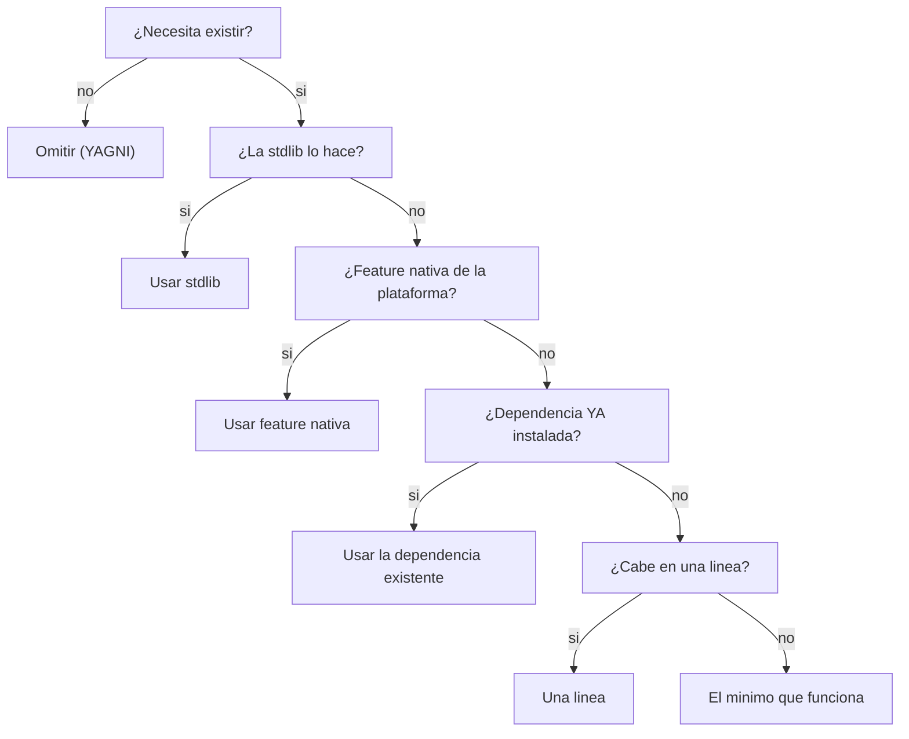

# evol-minimal

## Proposito

Los agentes tienden a sobre-construir: abstracciones prematuras, dependencias que
la stdlib ya cubre, capas de configuracion que nadie pidio. Cada linea de mas es
deuda: mas superficie de bug, mas tokens, mas coste, mas tiempo. Esta skill
fuerza la pregunta "¿esto necesita existir?" antes de escribir, y empuja hacia
el escalon mas bajo de la escala que cumpla el requisito real.

No es austeridad ciega: los guardrails (validacion en trust-boundary, manejo de
perdida de datos, seguridad, accesibilidad) nunca se recortan. La ganancia viene
de eliminar lo innecesario, no de bajar la defensa.

## Decision ladder

Antes de generar codigo, recorrer la escala de arriba hacia abajo y detenerse en
el primer escalon que resuelva el requisito:



Regla de oro: agregar una **nueva** dependencia es el ultimo recurso, no el
primero. Si la stdlib lo cubre, no se instala nada.

## Niveles

Mismo patron que `evol-compact --level`. El nivel ajusta cuan agresivo es el
enforcement, no si los guardrails aplican (siempre aplican).

| Nivel | Comportamiento |
|-------|---------------|
| `lite` | Solo evita deps nuevas obvias y codigo muerto. Intervencion minima. |
| `full` | Recorre la escala completa en cada decision de codigo. **Default.** |
| `ultra` | Minimizacion agresiva: reescribe abstracciones, colapsa capas, cuestiona cada archivo nuevo. Para bases muy infladas. |
| `off` | Desactiva el enforcement. |

```
/minimal               # muestra el nivel actual
/minimal full          # fija el nivel
/minimal off           # desactiva
```

El nivel se persiste en `.evol/.minimal-level` (un archivo con el string del
nivel, gitignored). Si no existe, default = `full`.

## Guardrails (nunca se recortan)

El ladder optimiza implementacion, no recorta defensa. Estas dimensiones quedan
fuera de la tijera siempre, en cualquier nivel:

- Validacion en el trust-boundary (input externo nunca se confia)
- Manejo de perdida de datos (escrituras, migraciones, borrados)
- Seguridad (authn/authz, secrets, inyeccion)
- Accesibilidad (a11y en UI)

Si minimizar tocaria uno de estos, **no se minimiza**: se deja y se anota por que.

## Subcomandos

Cablean a herramientas que ya existen — esta skill solo aporta el lente
anti-bloat; no reimplementa review/audit/eval.

| Subcomando | Que hace | Cablea a |
|-----------|----------|----------|
| `/minimal review` | Revisa el diff actual buscando sobre-ingenieria (deps de mas, abstraccion prematura, codigo muerto) | `/code-review` + lente del ladder |
| `/minimal audit` | Escanea el repo por complejidad acumulada | `evol-shield` audit |
| `/minimal debt` | Consolida marcadores `minimal:` del codigo en tareas accionables del ledger de deuda | `scripts/debt/budget.py` (skill `evol-debt-budget`) |
| `/minimal gain` | Mide reduccion (LOC, tokens, deps) de aplicar la skill | `evol-eval` harness |

### Marcador `minimal:`

Cuando algo no se simplifica ahora pero deberia, dejar un marcador en un comentario
del codigo con el prefijo del lenguaje (`#`, `//`, `--`, ...) seguido de
`minimal: <razon>`. Ejemplo (Python): un comentario `# ` seguido de
`minimal: esta clase wrapper sobra si migramos a dataclass`.

El scanner solo cuenta marcadores en comentarios, no menciones en prosa o strings.
`/minimal debt` recoge todos esos marcadores del repo y los vuelca como entradas
en el ledger de `evol-debt-budget`, en vez de que se pierdan como TODOs sueltos.

## Integracion en el pipeline

- **Fase Build (4):** el orquestador aplica el ladder al construir cada feature —
  prefiere el escalon mas bajo que cumpla el requisito. Un agente que mete una
  dependencia evitable falla el sub-gate de minimalismo.
- **Fase QA/Review (5):** `/minimal review` corre sobre el diff antes del gate,
  junto a `/code-review`. Sobre-ingenieria detectada → se registra en lecciones.

## Referencias

- Inspiracion: ponytail — github.com/DietrichGebert/ponytail (MIT)
- Mecanica de niveles: `skills/evol-compact/SKILL.md`
- Ledger de deuda: `skills/evol-debt-budget/SKILL.md`
- Portabilidad IDE: `scripts/evol-adapt.sh`
