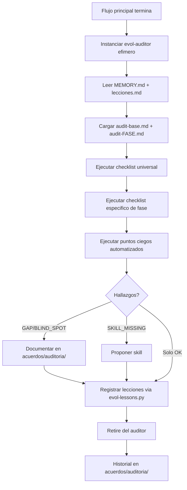

# /evol audit — Auditoria por Fase

> Este workflow instancia el agente `evol-auditor` como sub-agente efimero
> para una fase especifica. El auditor vive solo durante la auditoria y registra
> lecciones antes de desaparecer.

## Invocacion

```bash
/evol audit --fase=<release|sprint|doc-granular|skill-creation|briefing>
```

O automaticamente al final de cada flujo principal (sprint, release, doc-granular).

---

## 0. Instanciacion del Auditor

```bash
TIMESTAMP=$(date +%Y%m%d%H%M)
python3 scripts/evol-agent-lifecycle.py create \
  --name "evol-auditor-${FASE}-${TIMESTAMP}" \
  --task "Auditoria de fase ${FASE}" \
  --expires-after 1
```

---

## 1. Carga de Contexto

El auditor lee en este orden:
1. `acuerdos/memoria/MEMORY.md` — estado actual del proyecto.
2. `lecciones.md` — lecciones existentes (para no repetirlas).
3. `templates/audit/audit-base.md` — checklist universal.
4. `templates/audit/audit-<FASE>.md` — checklist especifico de la fase.

---

## 2. Ejecucion del Checklist

Por cada item del checklist:
- Ejecutar el comando de verificacion asociado (si existe).
- Asignar veredicto: `[OK]`, `[GAP]`, `[BLIND_SPOT]`, `[SKILL_MISSING]`.
- Si es `[GAP]` o `[BLIND_SPOT]`: documentar accion sugerida.

**Puntos Ciegos Universales (ejecutar siempre):**

```bash
# 1. JSON sidecars faltantes
find docs/ acuerdos/ -name "*.md" 2>/dev/null | while read f; do
  [ ! -f "${f%.md}.json" ] && echo "[BLIND_SPOT] Sin sidecar: $f"
done

# 2. Anti-emoji check
grep -rE "[\x{1F300}-\x{1F9FF}]" docs/ --include="*.md" 2>/dev/null | grep -v ".git" \
  && echo "[GAP] Emojis encontrados" || echo "[OK] Sin emojis"

# 3. Memoria actualizada?
git diff --name-only HEAD~1 HEAD 2>/dev/null | grep -q "acuerdos/memoria" \
  && echo "[OK] Memoria actualizada" \
  || echo "[BLIND_SPOT] acuerdos/memoria/ sin cambios en este flujo"

# 4. Scripts sin mirror en src/
diff <(ls scripts/) <(ls src/evol_cli/scripts/) 2>/dev/null \
  && echo "[OK] Mirrors sincronizados" \
  || echo "[GAP] Scripts desincronizados entre scripts/ y src/evol_cli/scripts/"
```

---

## 3. Reporte de Hallazgos

Escribir en `acuerdos/auditoria/<FASE>-<TIMESTAMP>.md`:

```markdown
# Auditoria <FASE> — <ISO8601>

## Hallazgos

| # | Tipo | Severidad | Descripcion | Accion |
|---|------|-----------|-------------|--------|
| 1 | GAP | HIGH | ... | ... |

## Skills Propuestas
- [ ] `<nombre-skill>`: <descripcion de la capacidad faltante>

## Resumen
- Items auditados: N
- OK: N | GAP: N | BLIND_SPOT: N | SKILL_MISSING: N
- Estado: APROBADO | OBSERVACIONES | BLOQUEADO
```

---

## 4. Registro de Lecciones (OBLIGATORIO)

Por cada `[GAP]` o `[BLIND_SPOT]` detectado:

```bash
python3 scripts/evol-lessons.py add \
  --categoria <PROCESO|ARQUITECTURA|HERRAMIENTAS|SEGURIDAD> \
  --leccion "<descripcion precisa de la leccion aprendida>"
```

---

## 5. Retire del Auditor

```bash
python3 scripts/evol-agent-lifecycle.py retire \
  "evol-auditor-${FASE}-${TIMESTAMP}"
```

El auditor NO puede retirarse sin haber completado el paso 4 (lecciones).

---

## Integracion con Flujos Existentes

Los siguientes workflows invocan al auditor automaticamente al final:

| Workflow | Fase auditada | Punto de invocacion |
|----------|---------------|---------------------|
| `/evol sprint` | `sprint` | Despues de paso 7 (post-sprint) |
| `/evol release-cut` | `release` | Antes del tag git |
| `/evol doc-granular` | `doc-granular` | Al finalizar generacion |
| `/evol crear-skill` | `skill-creation` | Antes del commit |

Para invocar manualmente al final de cualquier flujo:
```
/evol audit --fase=<fase>
```

---

## Diagrama del Ciclo Auditor


